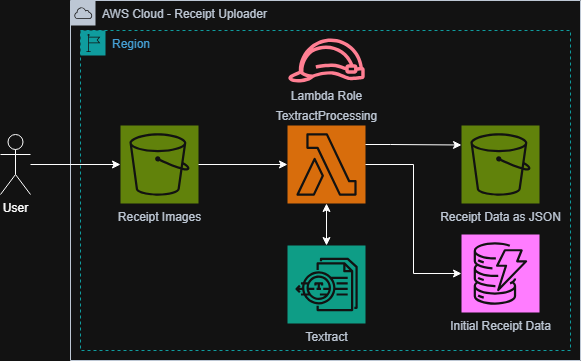

# Overview
This project is a fully serverless, event-driven AWS pipeline designed to automatically process receipt images upon upload. By eliminating the need for dedicated server infrastructure, the architecture reduces operational overhead and scales seamlessly without manual intervention.
# Architecture
The pipeline is triggered by an S3 upload event, which invokes an AWS Lambda function to begin processing the uploaded receipt image. Lambda passes the image to AWS Textract, which leverages machine learning to perform intelligent optical character recognition (OCR), automatically extracting and structuring the raw text data from the receipt. The extracted data is then written to a DynamoDB table for downstream storage and retrieval, completing a fully automated end-to-end pipeline with no manual steps required.
# Security
Security is enforced throughout the pipeline through the use of granular IAM roles and policies. Each service is granted only the specific permissions required to perform its function, adhering strictly to the principle of least privilege and ensuring that no component of the architecture has broader access than necessary.
# System Diagram
